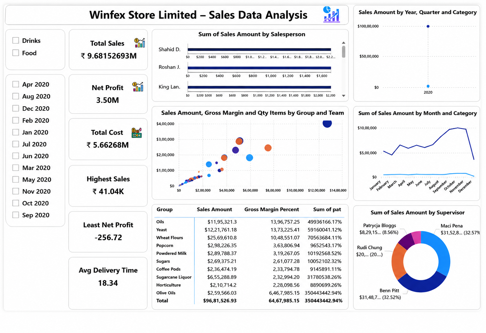

# Power BI Sales Dashboard

## Overview
This project is an interactive sales analysis dashboard developed using Power BI for Winfex Store Limited.

The dashboard provides insights into:
- Sales performance
- Profit analysis
- Gross margin
- Sales trends
- Category-wise analysis
- Supervisor and salesperson performance

## Tools & Technologies Used
- Power BI
- Power Query
- DAX
- Excel

## Dashboard Features
- Interactive filters and slicers
- KPI cards
- Sales trend analysis
- Profit insights
- Category-wise visualization
- Team performance tracking

## Files Included
- Power BI project file (.pbix)
- Dashboard preview image

## Dashboard Preview

## Author
Cheriyala Shivaprasad
